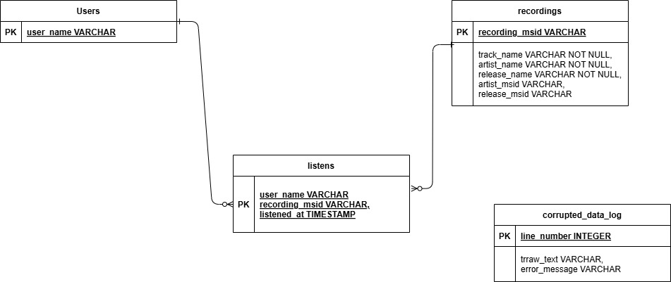

# ListenBrainz Ingestion & Queries

A Python project that:

1. Ingests a ListenBrainz dataset file into DuckDB to implement Task 1.
2. Provides data_analysis jupyter notebook to answer Task 2.

---

## Prerequisites

- Python 3.10+ installed
- All the dependencies installed

---

## Folder Structure

```bash
Test-Assignment-Data-Engineer/
├── README.md
├── requirements.txt
├── ingest.py
├── dataset.txt
├── data_analysis.ipynb
├── music-listens.duckdb
├── Entity-Relationship-Diagram.png
```

### !Creata a python virtual environement as a best practice

## 1. Install dependencies

From the project root, run:

```bash
pip install -r requirements.txt
```

This will install:

```bash
duckdb
pandas
jupyter
```

## 2. Ingest the data Task1

Put your dataset.txt in the project root.

Run:

```bash
python ingest.py dataset.txt [output.duckdb]
```

dataset.txt is required.

[output.duckdb] is optional; defaults to music-listens.duckdb

Example:

```bash
python ingest.py dataset.txt my_listens.duckdb
```

After this, you’ll have a DuckDB file (e.g. music-listens.duckdb) with tables:

users
recordings
listens
corrupted_data_log

### Below is the ER Diagram



## 3. Run SQL queries in Jupyter Notebook

Ensure music-listens.duckdb (or your chosen DB file) is in the project root.

Launch Jupyter:

```bash
jupyter notebook
```

Open data_analysis.ipynb in your browser and follow the instructions
